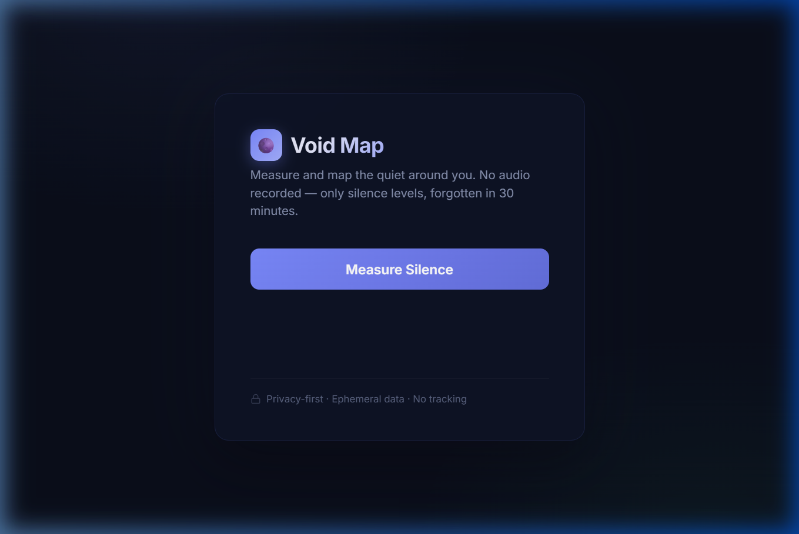
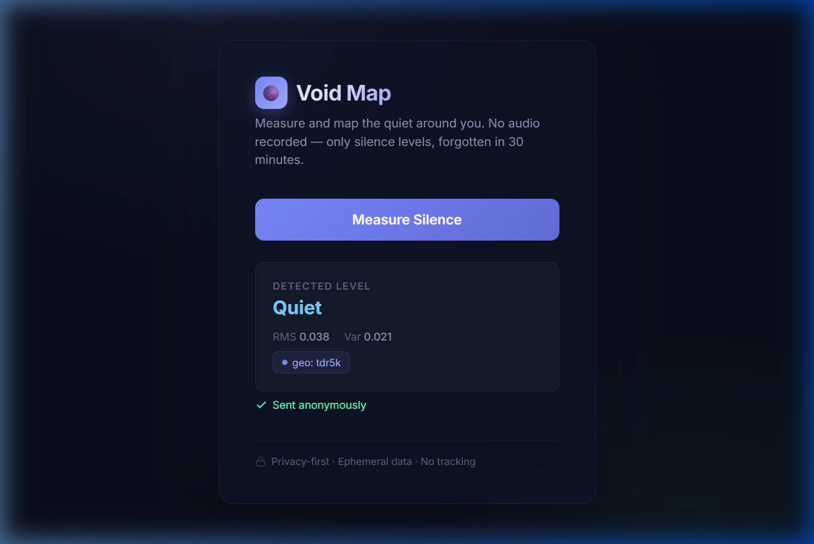

# VOID-MAP

> Privacy-first serverless system for mapping quiet places using ephemeral cloud data.

**Forgetting is enforced by infrastructure, not discipline.**

VOID-MAP captures ambient noise levels from users' microphones, classifies them into silence buckets, stores them transiently in DynamoDB (30-minute TTL), and serves aggregated "quiet scores" per geographic tile. No audio is recorded — only noise level categories, which are automatically deleted after 30 minutes.

---

## Demo

<p align="center">
  
  <br>
  <em>Clean, minimal interface — one button to measure silence</em>
</p>

<p align="center">
  
  <br>
  <em>Result card showing noise level, RMS/Var values, geohash, and anonymous send confirmation</em>
</p>

---

## Architecture

```
Client (browser)
  ↓ POST /signal
API Gateway (HTTP API)
  ↓
Write Lambda → DynamoDB (TTL = 30 min)
  ↑
Read Lambda ← GET /quiet/{geo}
  ↑
API Gateway
  ↑
Client / Consumer
```

See [architecture.md](architecture/architecture.md) for details.

---

## Project Structure

```
VOID-MAP/
├── api/
│   └── routes.md              # API route definitions & schemas
├── architecture/
│   └── architecture.md        # System design & component diagram
├── client/
│   └── index.html             # Browser client — mic capture + signal POST
├── lambdas/
│   ├── write_signal/
│   │   └── handler.py         # Validate & store silence signals
│   └── read_aggregation/
│       └── handler.py         # Aggregate & return quiet scores
└── phases/
    ├── phase-0.md              # Design & documentation
    ├── phase-1.md              # Infrastructure setup
    ├── phase-2.md              # Write path implementation
    └── phase-3.md              # Read path & aggregation
```

---

## Local Development

### Prerequisites
- Python 3.9+
- AWS CLI configured with appropriate credentials
- A DynamoDB table named `voidmap_ephemeral_signals` with:
  - Partition key: `geo` (String)
  - Sort key: `ts` (String) — composite `"timestamp#uuid"`
  - TTL attribute: `expires_at`

### Running the Client
Open `client/index.html` in any modern browser, or serve it locally:
```bash
cd client
python -m http.server 8000
```
Then visit `http://localhost:8000`.

### Deploying Lambdas
Package each Lambda handler and deploy via the AWS Console or CLI:
```bash
cd lambdas/write_signal
zip write_signal.zip handler.py
aws lambda update-function-code --function-name voidmap-write-signal --zip-file fileb://write_signal.zip

cd ../read_aggregation
zip read_aggregation.zip handler.py
aws lambda update-function-code --function-name voidmap-read-aggregation --zip-file fileb://read_aggregation.zip
```

---

## API Usage

### POST `/signal` — Submit a noise reading
```json
{
  "ts": 1710000000,
  "geo": "tdr5",
  "noise_bucket": "quiet"
}
```

### GET `/quiet/{geo}` — Get the quiet score
```json
{
  "geo": "tdr5",
  "quiet_score": 0.85,
  "confidence": "medium",
  "window_minutes": 30
}
```

See [routes.md](api/routes.md) for full request/response schemas.

---

## Future Scope

🗺️ **Interactive Quiet Map**
- Real-time heatmap visualization of quiet scores across geohash tiles
- Leaflet/Mapbox integration with color-coded overlays (green = quiet, red = loud)

📊 **Richer Analytics**
- Historical trend tracking per geohash (requires opt-in relaxed TTL for aggregate-only data)
- Time-of-day patterns — discover when places are quietest
- Neighboring geohash expansion for broader area queries

🔔 **Smart Notifications**
- "Your favorite park is quiet right now" — push alerts based on user-defined watch areas
- Noise spike detection per tile

📱 **Mobile-First Enhancements**
- Progressive Web App (PWA) with offline support and install prompt
- Background periodic measurements (with user consent)
- Haptic feedback on measurement completion

🔒 **Infrastructure Hardening**
- API Gateway throttling and per-IP rate limiting
- Infrastructure as Code (SAM / Terraform) for one-click deployment
- CloudWatch dashboards for Lambda metrics and DynamoDB throughput
- Automated integration tests with mocked DynamoDB

🌍 **Community Features**
- Public leaderboard of quietest neighborhoods (aggregated, non-identifying)
- Crowd-sourced quiet spot recommendations
- Embeddable widget for third-party sites

---

## Contributing

1. Fork the repository
2. Create a feature branch (`git checkout -b feature/your-feature`)
3. Commit your changes
4. Push and open a Pull Request

Please follow the project's privacy-first philosophy — no user-identifiable data should be logged, stored, or transmitted.

---

## License

This project is licensed under the [MIT License](LICENSE).
