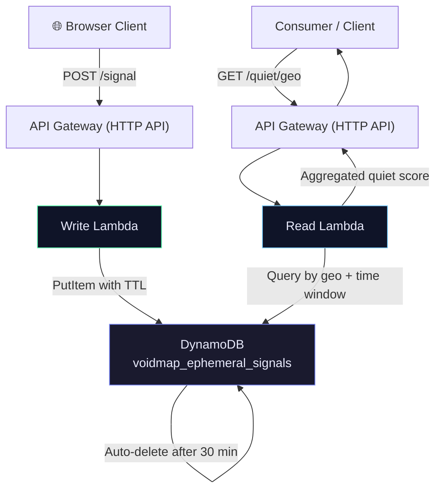

# Architecture Overview

VOID-MAP is a privacy-first, serverless system built on AWS. All data is ephemeral — automatically deleted after 30 minutes via DynamoDB TTL.

> **Core Principle:** Forgetting is enforced by infrastructure, not discipline.

---

## System Diagram



---

## Components

### Client (`client/index.html`)
- Captures microphone audio for ~1.2 seconds
- Computes RMS amplitude and sample variation
- Classifies into noise buckets: `very_quiet`, `quiet`, `moderate`, `loud`
- Computes geohash from real GPS coordinates (precision 4)
- POSTs `{ts, geo, noise_bucket}` to the API
- **No audio is recorded or transmitted** — only the classification bucket

### API Gateway
- HTTP API with two routes: `POST /signal` and `GET /quiet/{geo}`
- CORS enabled for browser access
- Recommended: configure throttling for rate limiting

### Write Lambda (`lambdas/write_signal/handler.py`)
- Validates input: type-checks `ts`, length-checks `geo`, allowlists `noise_bucket`
- Validates timestamp is within ±5 minutes of server time
- Generates a unique `signal_id` (UUID) per signal to prevent DynamoDB key collisions
- Stores signal with `expires_at` TTL (30 minutes from now)
- Logs only non-sensitive fields (geo, bucket, expiry)

### Read Lambda (`lambdas/read_aggregation/handler.py`)
- Queries DynamoDB for all signals matching a geohash within the last 30 minutes
- Paginates results using `LastEvaluatedKey` for completeness
- Computes weighted quiet score: `very_quiet=1.0`, `quiet=0.75`, `moderate=0.4`, `loud=0.1`
- Returns confidence level based on signal count: `low` (≤5), `medium` (6-20), `high` (>20)

### DynamoDB (`voidmap_ephemeral_signals`)
- Partition key: `geo` (String) — geohash tile
- Sort key: `ts` (Number) — Unix timestamp
- TTL attribute: `expires_at` — automatically deletes items after 30 minutes
- No backups, no streams — data is intentionally disposable

---

## Data Lifecycle

```
Signal created → Stored with 30-min TTL → Queryable while alive → Auto-deleted by DynamoDB
```

1. Client measures ambient noise and classifies it
2. Signal is POSTed with timestamp, geohash, and noise bucket
3. Write Lambda validates and stores with a 30-min `expires_at`
4. Read Lambda aggregates recent signals into a quiet score
5. DynamoDB TTL automatically purges expired items — **no manual cleanup needed**

---

## Privacy Guarantees

- **No audio stored** — only noise level categories
- **No user identity** — no cookies, tokens, or IP logging
- **Ephemeral by design** — TTL enforces deletion at the infrastructure level
- **Coarse location** — geohash precision 4 (~40km² tiles)
- **Non-sensitive logging** — only geo tile, bucket, and expiry time
